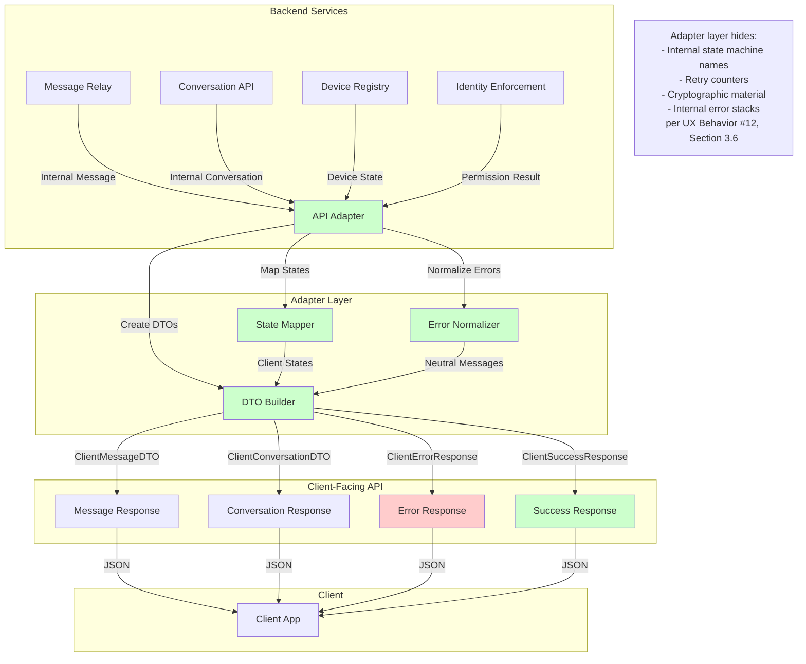
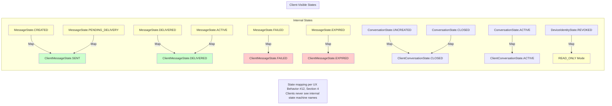
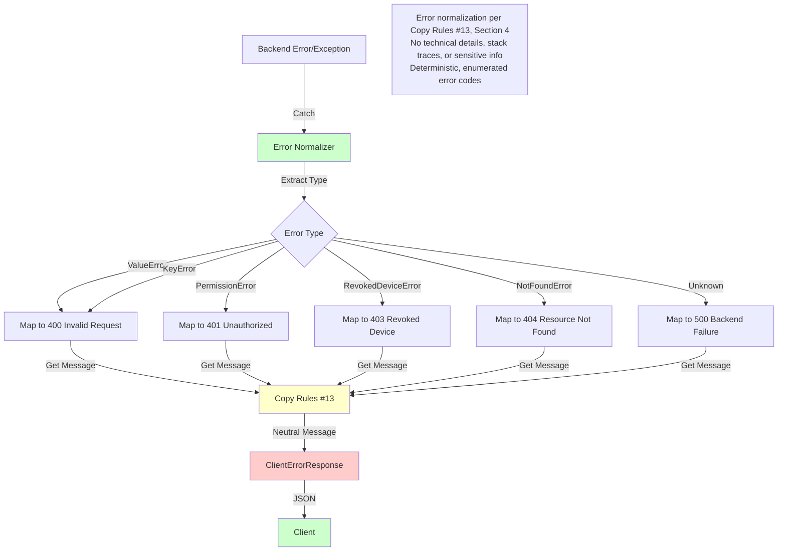
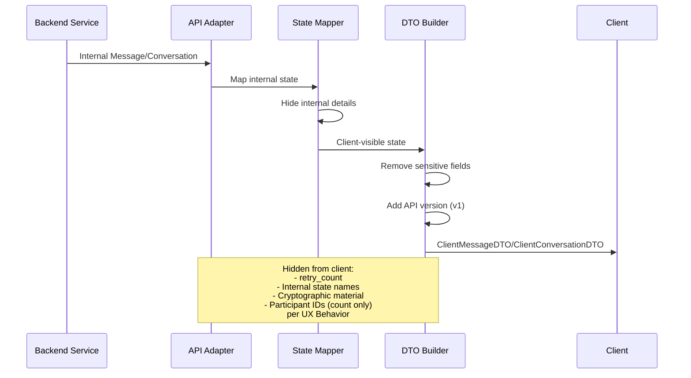
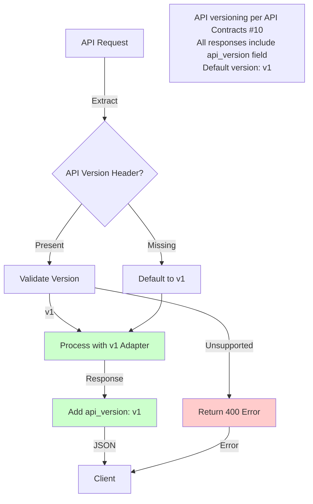
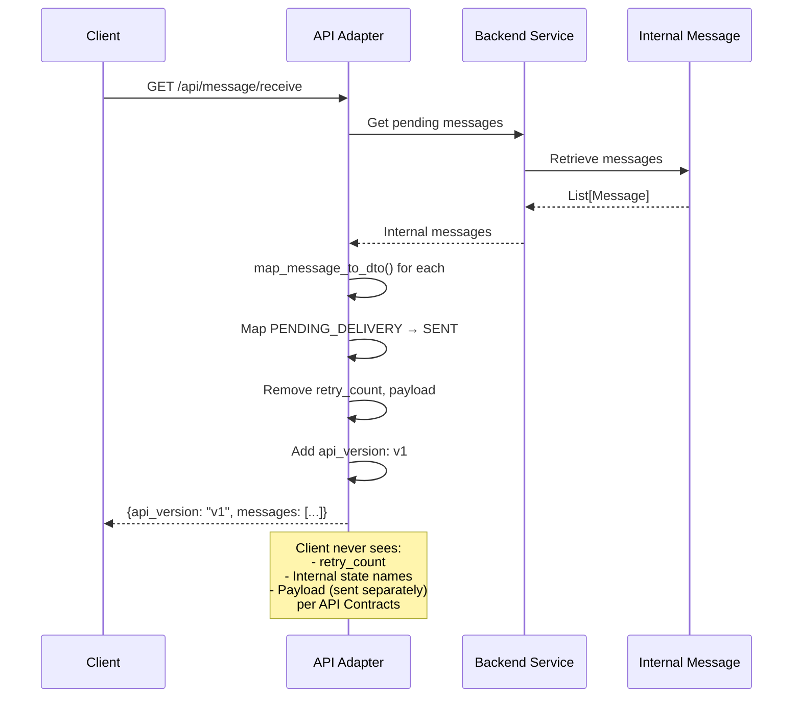
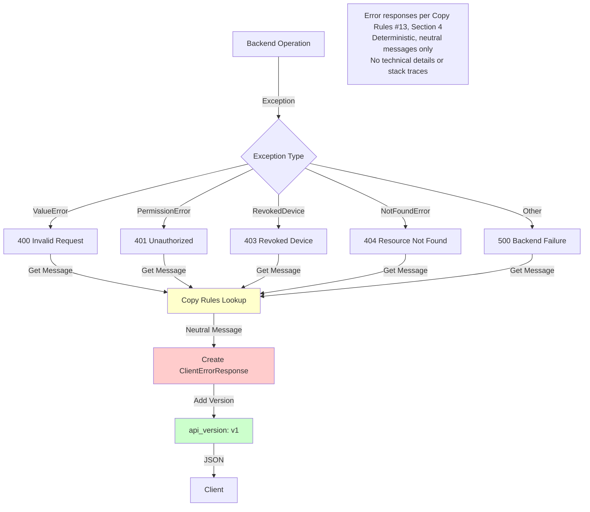

# API Boundary and Adapter Layer Diagrams

**References:**
- API Contracts (#10)
- UX Behavior (#12)
- Copy Rules (#13)
- Functional Specification (#6)
- Architecture (#9)
- Resolved Specs & Clarifications

## Backend → Client Boundary Flow

## State Mapping Flow

## Error Normalization Pipeline

## DTO Transformation Flow

## API Versioning Flow

## Message Response Flow

## Error Response Flow

## Key Deterministic Rules

1. **State Mapping**: Internal states mapped to client-visible states per UX Behavior (#12), Section 4
2. **No Internal Leakage**: Clients never see retry_count, internal state names, or cryptographic material per UX Behavior (#12), Section 3.6
3. **Error Normalization**: All errors normalized to neutral messages per Copy Rules (#13), Section 4
4. **API Versioning**: All responses include `api_version: v1` per API Contracts (#10)
5. **Deterministic Errors**: Error codes are enumerated and deterministic per API Contracts (#10), Section 6
6. **Content-Free**: No sensitive information in error responses per Copy Rules (#13), Section 4
7. **DTO Transformation**: Internal models transformed to client-safe DTOs hiding implementation details
8. **Read-Only Mode**: Revoked devices mapped to READ_ONLY state per Resolved Clarifications (#38)
