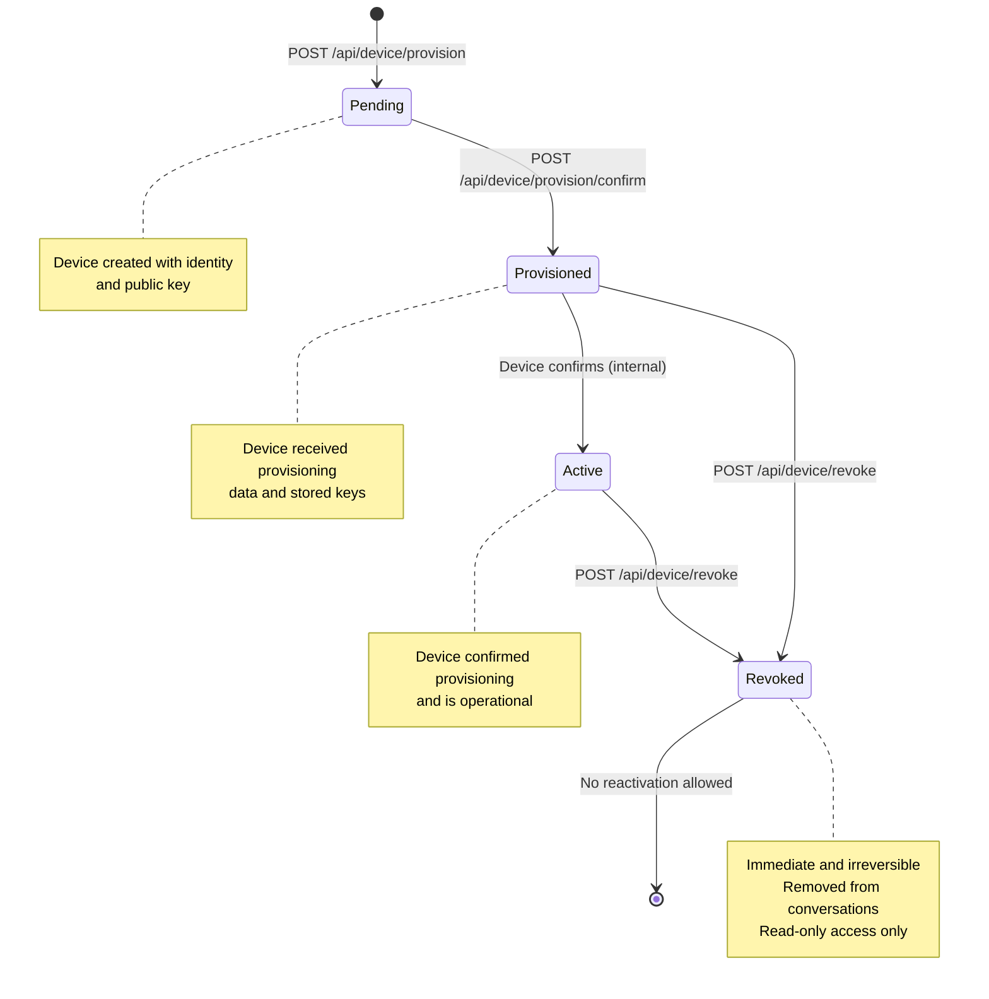
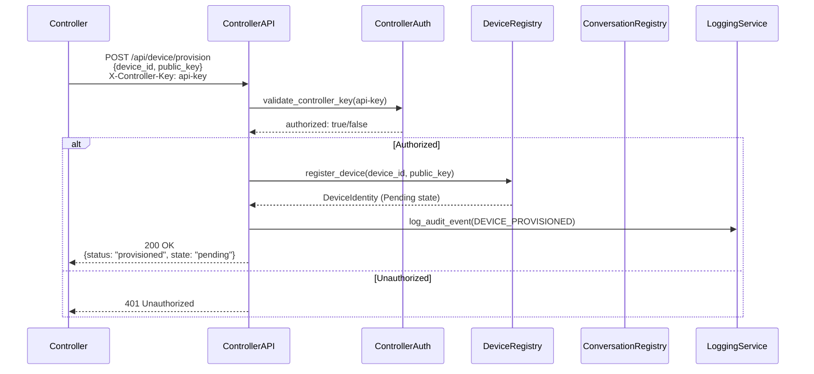
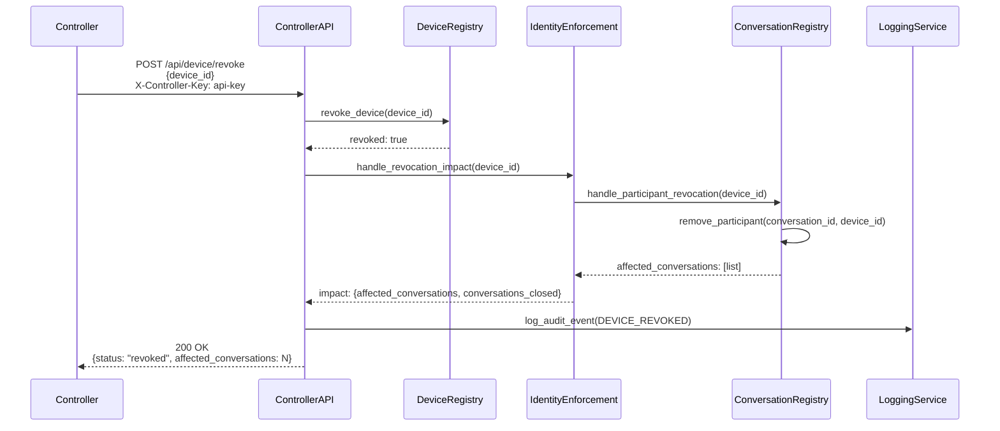
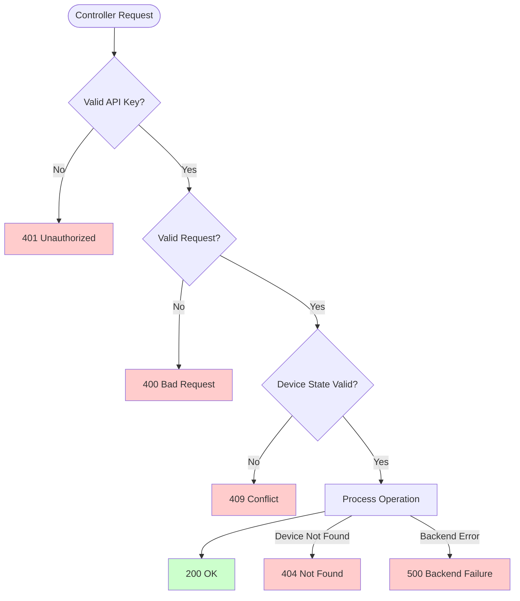

# Controller API Endpoints

## Overview

This document describes the Controller API endpoints for device provisioning and revocation per API Contracts (#10) and Identity Provisioning (#11).

## Endpoints

### POST /api/device/provision

Controller provisions a device with identity and keys. Creates device in Pending state.

### POST /api/device/provision/confirm

Controller confirms device provisioning. Transitions device from Pending → Provisioned state.

### POST /api/device/revoke

Controller revokes device. Revocation is immediate and irreversible. Revoked devices are removed from all conversations and enter neutral enterprise mode (read-only).

## State Transitions

## Controller Authentication Flow

## Revocation Impact Flow

## Error Handling

## References

- API Contracts (#10), Section 3.1 and 3.2
- Identity Provisioning (#11), Section 3 and 5
- State Machines (#7), Section 5
- Copy Rules (#13)
- Logging & Observability (#14)
