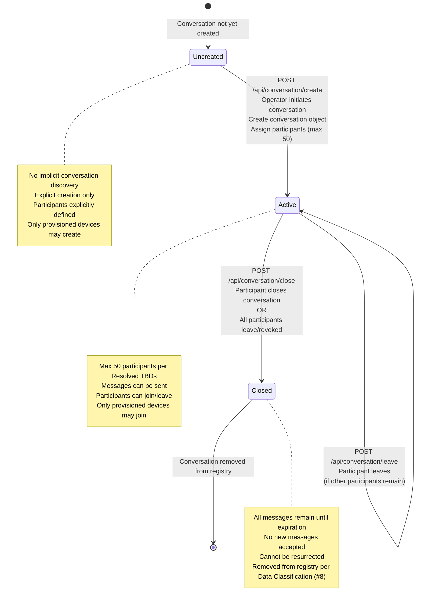
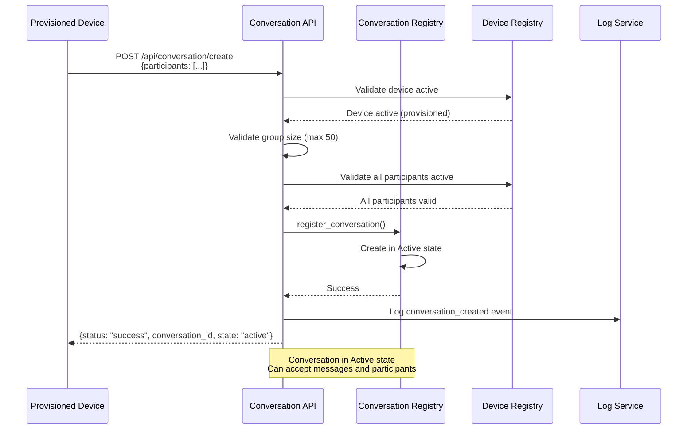
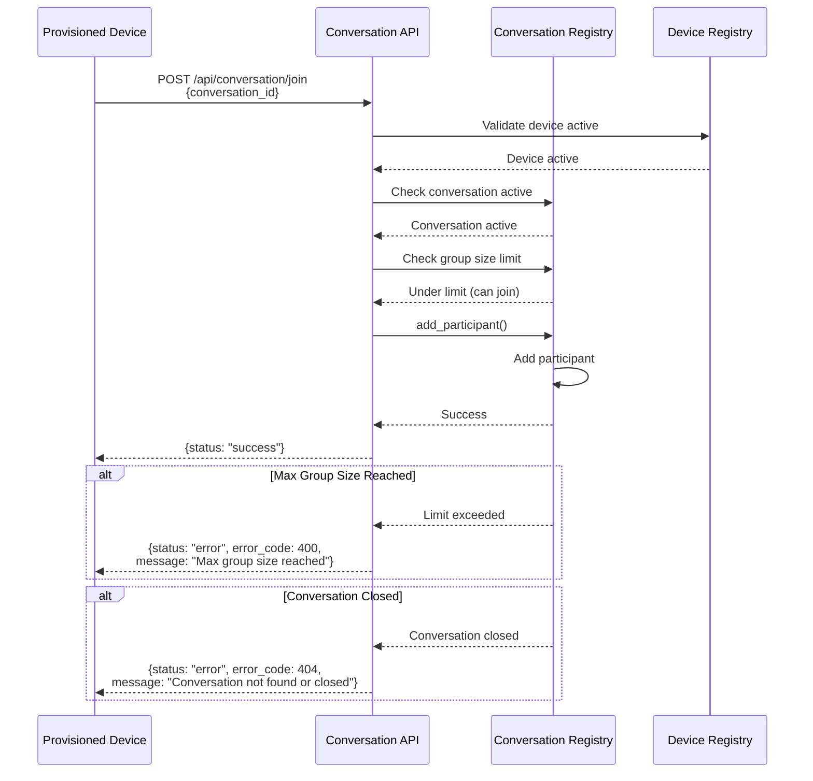
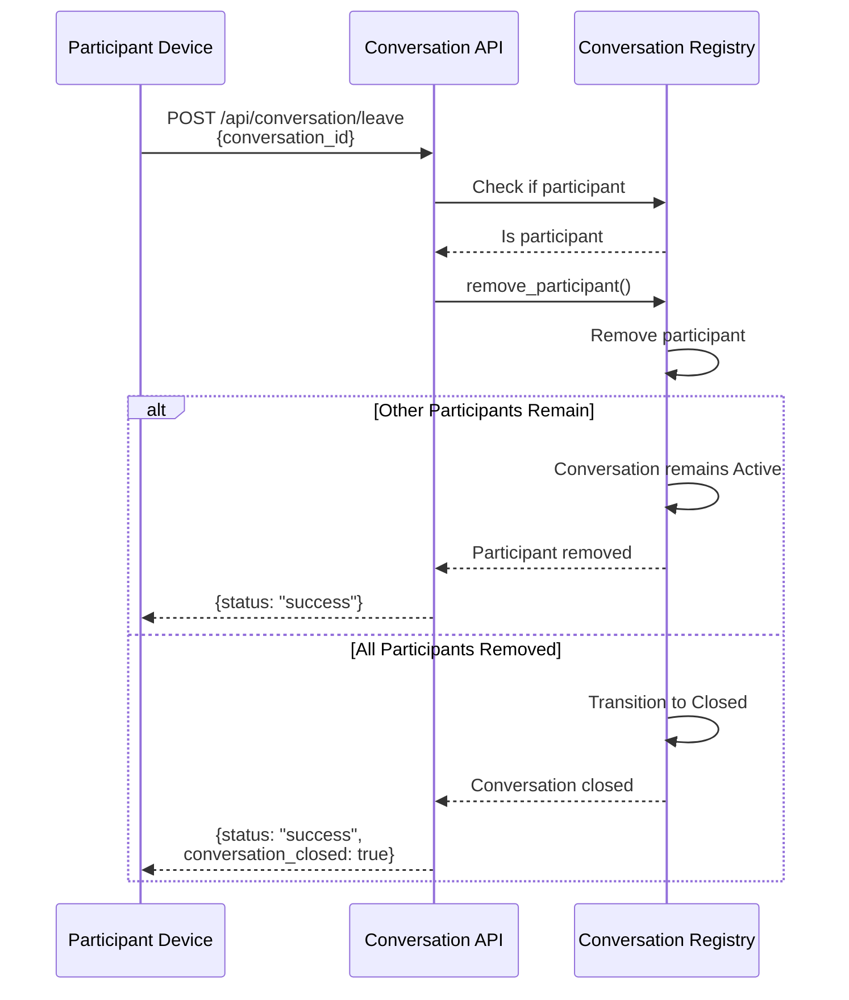
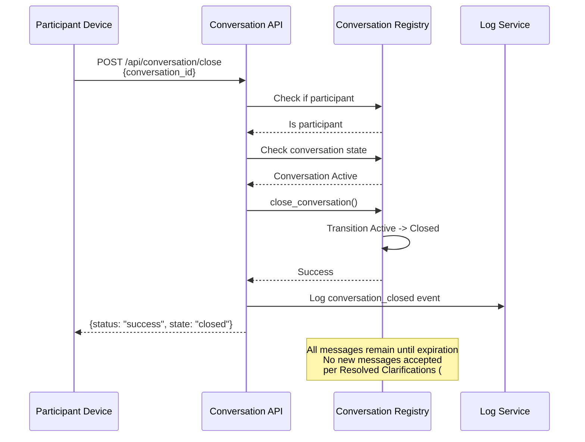
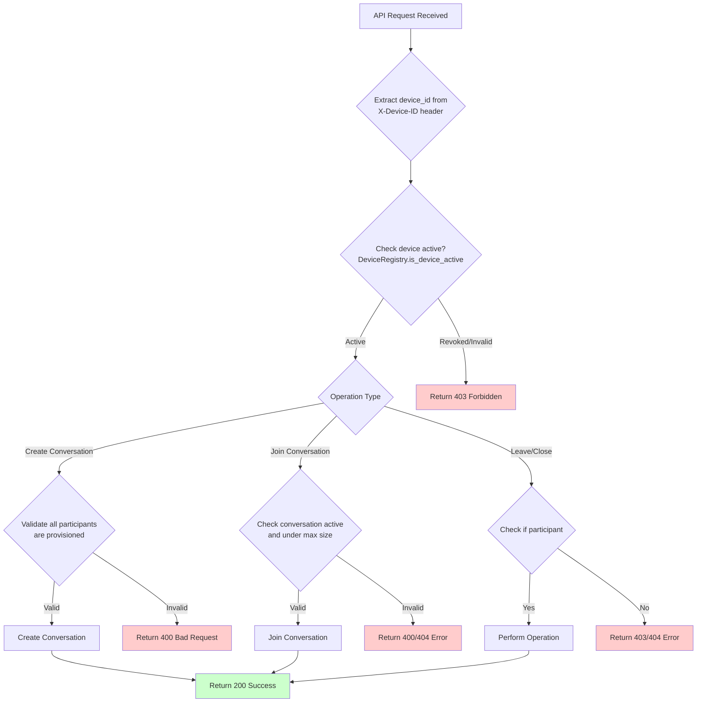
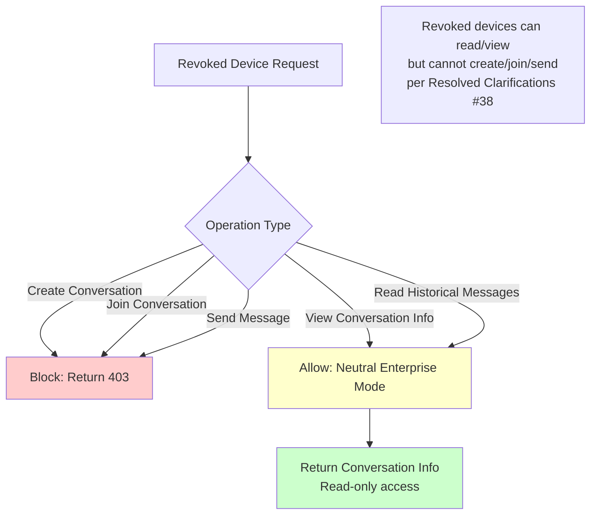

# Conversation API Lifecycle Diagrams

**References:**
- Functional Specification (#6), Section 4.1
- State Machines (#7), Section 4
- API Contracts (#10)
- Identity Provisioning (#11)
- Resolved Specs & Clarifications

## Conversation Lifecycle State Machine

## Conversation Creation Flow

## Participant Join Flow

## Participant Leave Flow

## Conversation Close Flow

## Permission Enforcement Flow

## Neutral Enterprise Mode Flow

## Key Deterministic Rules

1. **Permission Enforcement**: Only provisioned devices (Active state) may create or join conversations per Identity Provisioning (#11)
2. **Group Size Limit**: Max 50 participants per conversation per Resolved TBDs
3. **State Transitions**: Uncreated → Active → Closed per State Machines (#7), Section 4
4. **Conversation Closure**: All messages remain until expiration; no new messages accepted per Resolved Clarifications (#36)
5. **Participant Management**: Participants can join/leave; conversation closes if all leave per State Machines (#7), Section 4
6. **Neutral Enterprise Mode**: Revoked devices can view but cannot create/join per Resolved Clarifications (#38)
7. **Explicit Creation**: No auto-discovery; conversations must be explicitly created per State Machines (#7)
8. **Closed Conversations**: Cannot be resurrected per State Machines (#7)
