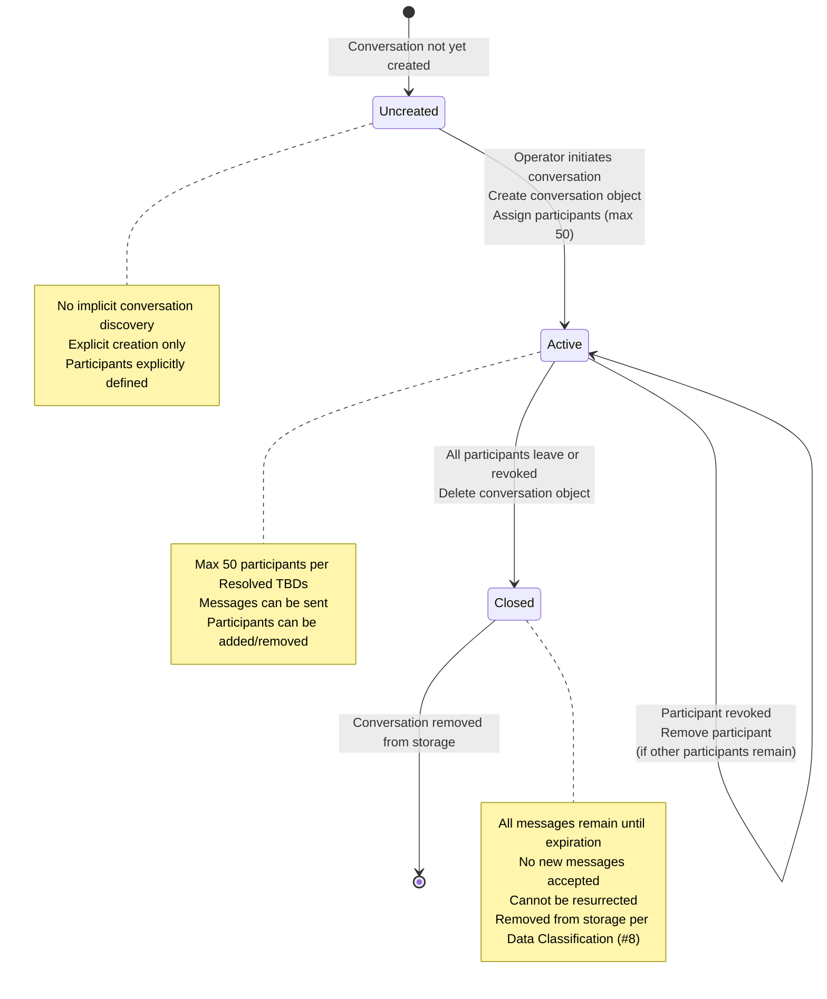
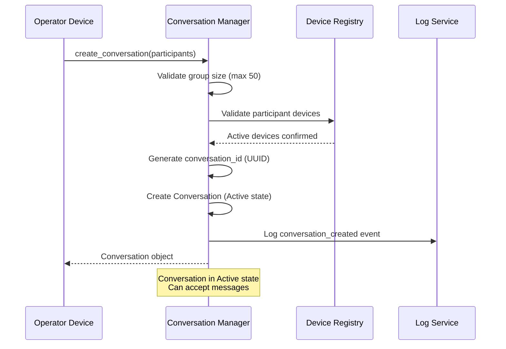
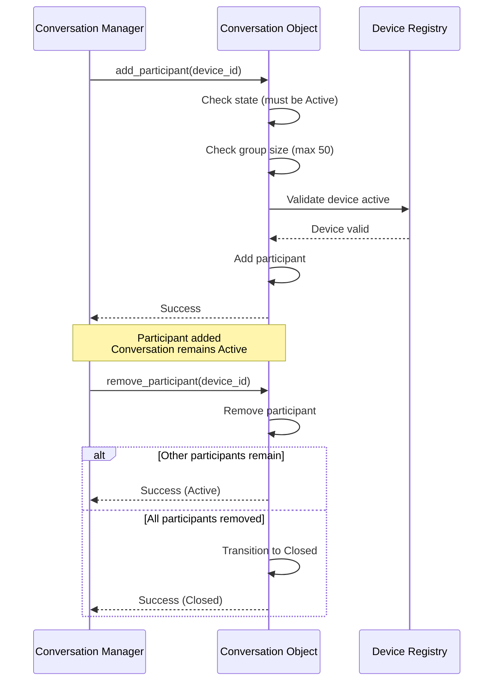
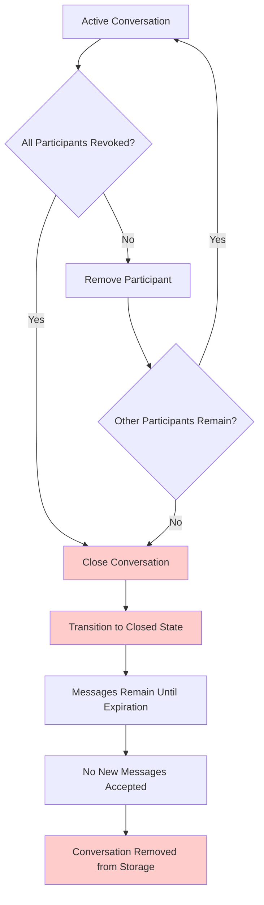
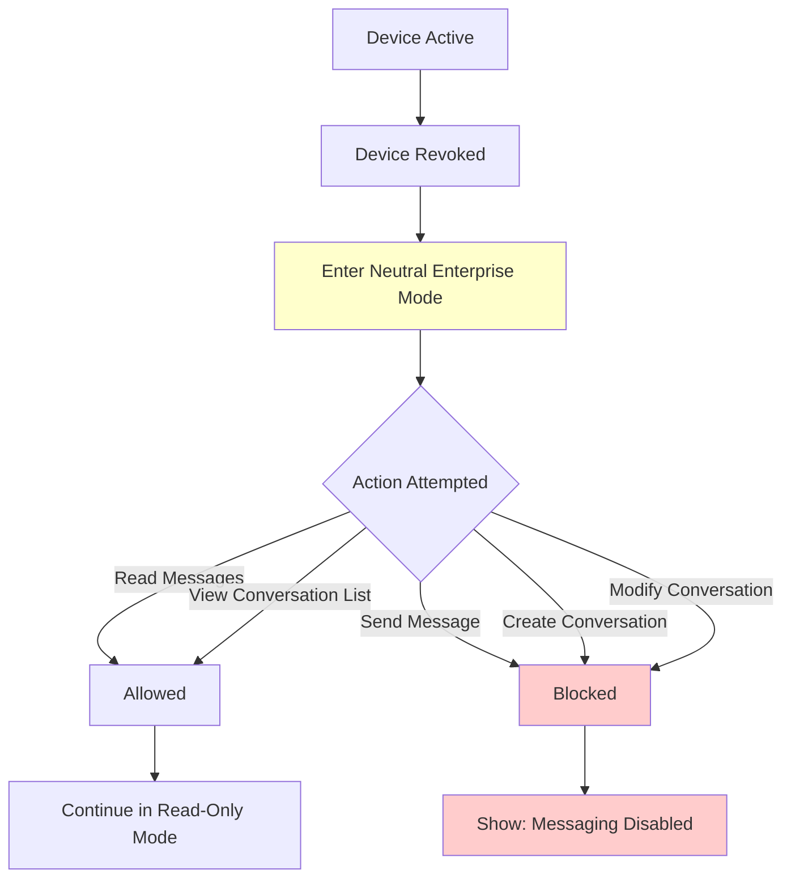

# Conversation Lifecycle State Diagram

**References:**
- State Machines (#7), Section 4
- Functional Specification (#6), Section 4.1
- Data Classification & Retention (#8), Section 3
- Resolved Specs & Clarifications

## Conversation Lifecycle State Machine

## Conversation Creation Flow

## Participant Management Flow

## Conversation Closure Flow

## Neutral Enterprise Mode Flow

## Key Deterministic Rules

1. **Conversation Creation**: Explicit only, no auto-discovery per State Machines (#7)
2. **Group Size Limit**: Max 50 participants per Resolved TBDs
3. **State Transitions**: Uncreated → Active → Closed per State Machines (#7)
4. **Closure Behavior**: All messages remain until expiration; no new messages accepted per Resolved Clarifications
5. **Participant Revocation**: Removes participant; closes conversation if all revoked per State Machines (#7)
6. **Neutral Enterprise Mode**: Read-only access for revoked devices per Resolved Clarifications
7. **Data Classification**: Conversation membership is Restricted; removed when conversation ends per Data Classification (#8)
