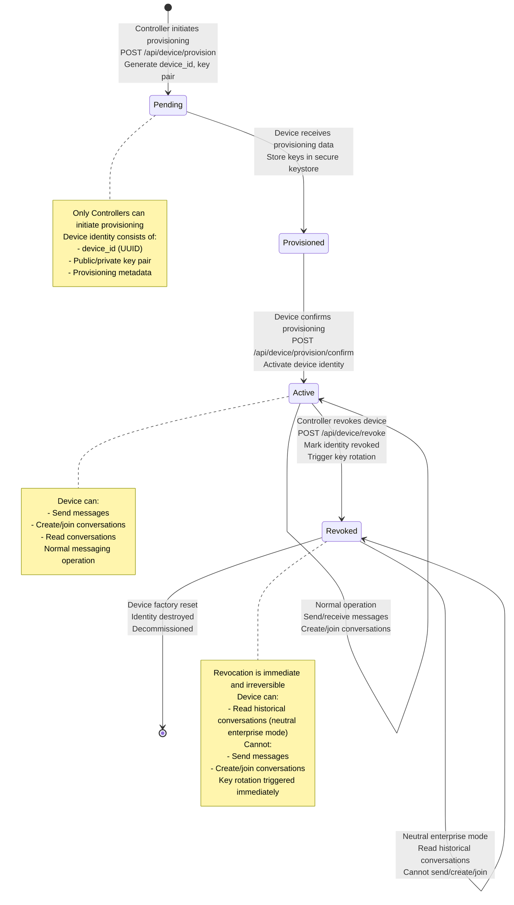
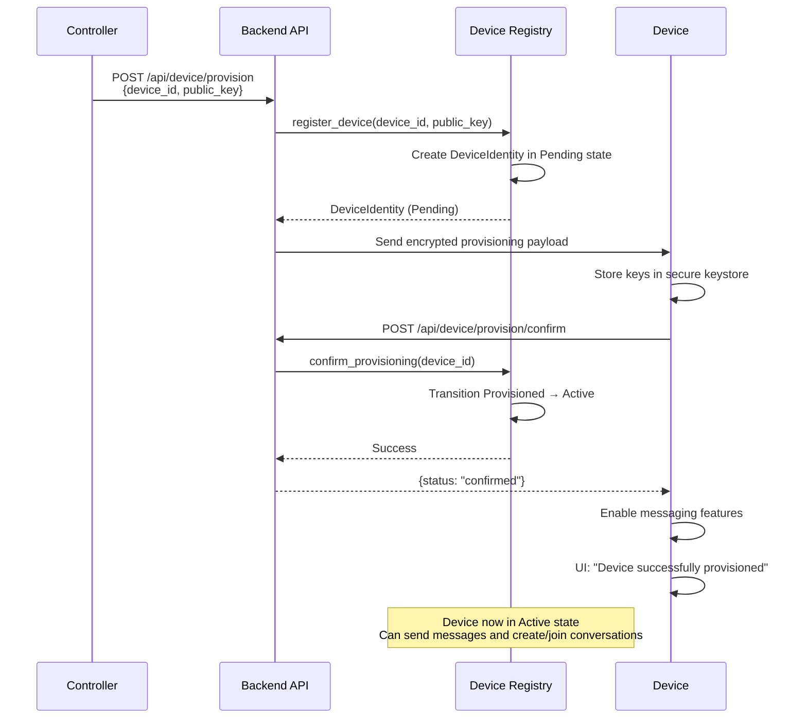
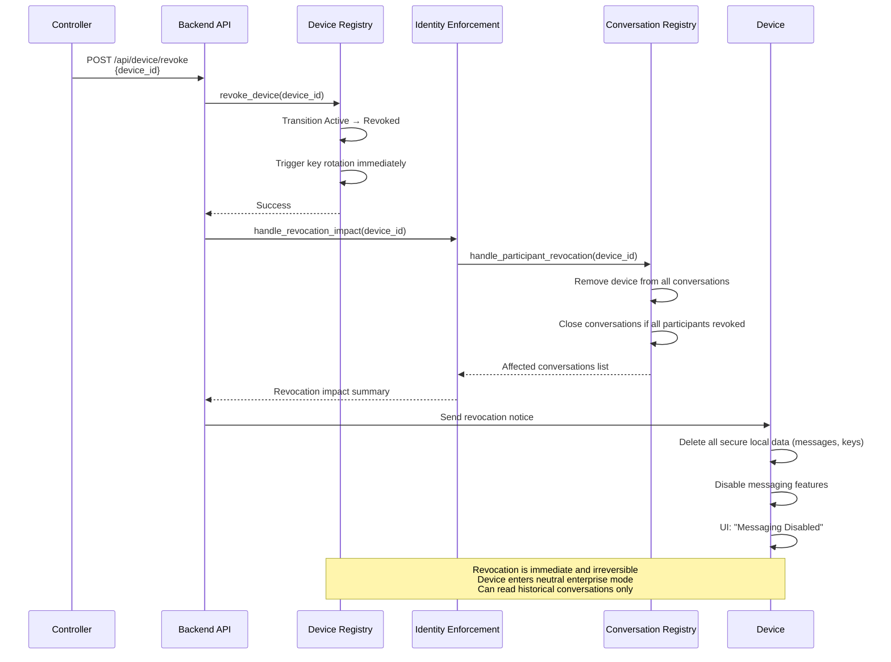
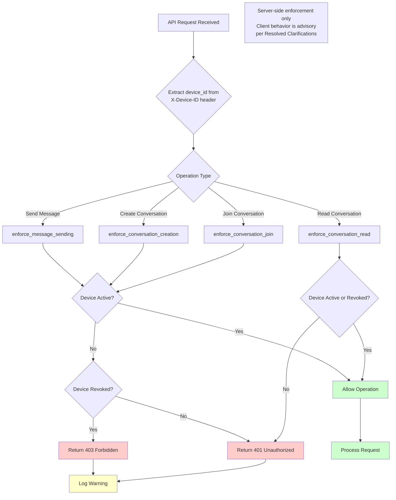
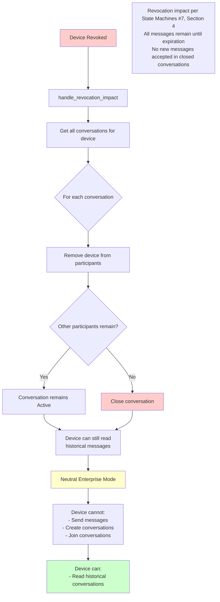

# Device Identity Lifecycle Diagrams

**References:**
- Identity Provisioning (#11)
- State Machines (#7), Section 5
- Functional Specification (#6), Section 3.1
- Lifecycle Playbooks (#15)
- Resolved Specs & Clarifications

## Device Identity Lifecycle State Machine



## Device Provisioning Flow



## Device Revocation Flow



## Key Rotation Flow

```mermaid
sequenceDiagram
    participant System
    participant Registry as Device Registry
    participant Device
    
    alt Scheduled Rotation (90 days)
        System->>Registry: get_devices_needing_key_rotation()
        Registry->>Registry: Check next_key_rotation timestamps
        Registry-->>System: List of devices needing rotation
        System->>Device: Request key rotation
        Device->>Device: Generate new key pair
        Device->>System: POST /api/device/rotate<br/>{device_id, new_public_key}
        System->>Registry: rotate_device_key(device_id, new_public_key)
        Registry->>Registry: Update public_key
        Registry->>Registry: Update last_key_rotation
        Registry->>Registry: Schedule next rotation (90 days)
        Registry-->>System: Success
    else Immediate Rotation (on revocation)
        System->>Registry: revoke_device(device_id)
        Registry->>Registry: Transition to Revoked
        Registry->>Registry: Update last_key_rotation = revoked_at
        Registry->>Registry: Clear next_key_rotation (no scheduled rotations)
        Registry-->>System: Revocation complete
    end
    
    Note over Registry: Key rotation occurs:
    - Every 90 days (scheduled)
    - Immediately upon revocation
    per Resolved TBDs
```

## Identity Enforcement Flow



## Revocation Impact on Conversations



## Permission Matrix

```mermaid
graph LR
    subgraph "Device States"
        P[Pending]
        Pr[Provisioned]
        A[Active]
        R[Revoked]
    end
    
    subgraph "Permissions"
        S[Send Messages]
        C[Create Conversations]
        J[Join Conversations]
        Re[Read Conversations]
    end
    
    P -->|None| S
    Pr -->|None| S
    A -->|Allowed| S
    R -->|Denied| S
    
    P -->|None| C
    Pr -->|None| C
    A -->|Allowed| C
    R -->|Denied| C
    
    P -->|None| J
    Pr -->|None| J
    A -->|Allowed| J
    R -->|Denied| J
    
    P -->|None| Re
    Pr -->|None| Re
    A -->|Allowed| Re
    R -->|Allowed| Re
    
    style A fill:#ccffcc
    style R fill:#ffcccc
    style S fill:#ffffcc
    style C fill:#ffffcc
    style J fill:#ffffcc
    style Re fill:#ccffcc
    
    note1[Permission matrix per Resolved Clarifications #38<br/>Revoked devices can read (neutral enterprise mode)<br/>All enforcement is server-side]
```

## Key Deterministic Rules

1. **State Transitions**: Pending → Provisioned → Active → Revoked per State Machines (#7), Section 5
2. **Revocation**: Immediate and irreversible per Identity Provisioning (#11), Section 5
3. **Key Rotation**: Every 90 days or immediately upon revocation per Resolved TBDs
4. **Permission Enforcement**: Server-side only; client behavior is advisory per Resolved Clarifications
5. **Revoked Device Permissions**:
   - Cannot send messages per Resolved Clarifications (#38)
   - Cannot create or join conversations per Resolved Clarifications (#38)
   - May read historical conversations (neutral enterprise mode) per Resolved Clarifications (#38)
6. **No Message Delivery**: No messages may be delivered from revoked or expired devices per Functional Spec (#6)
7. **Controller Authority**: Only Controllers can move devices between states per State Machines (#7)
