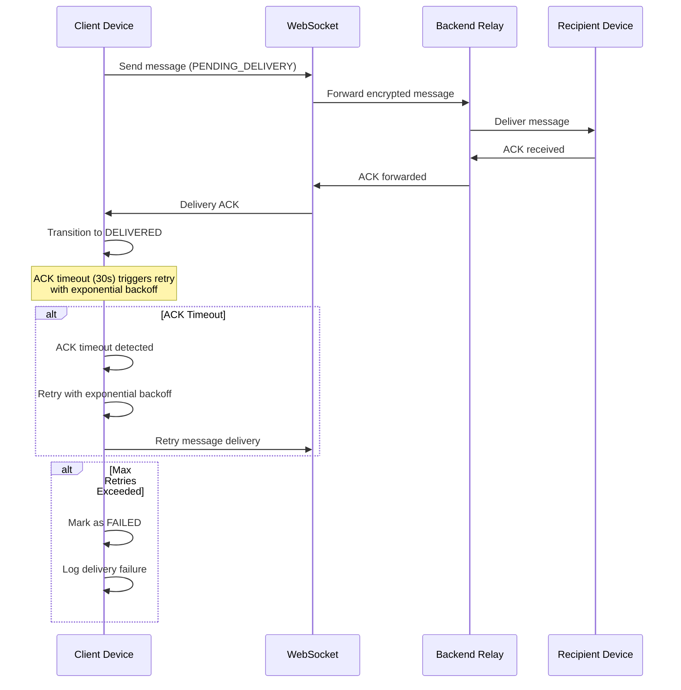
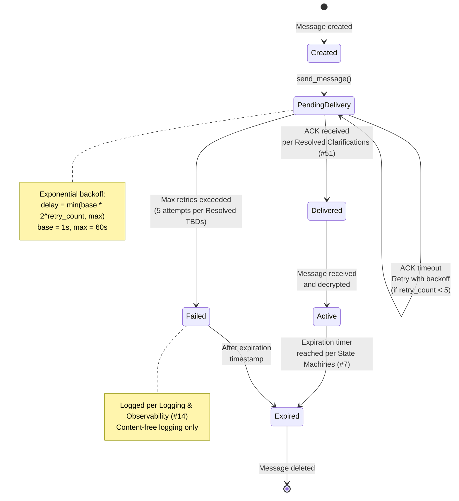
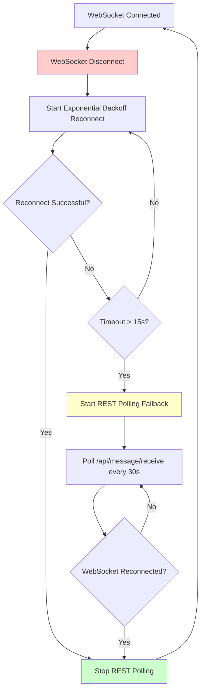
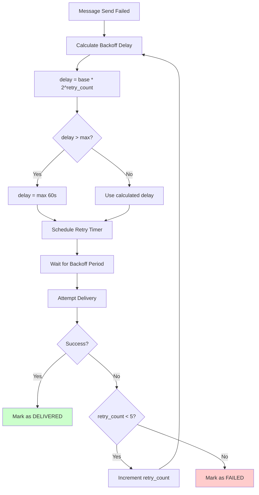
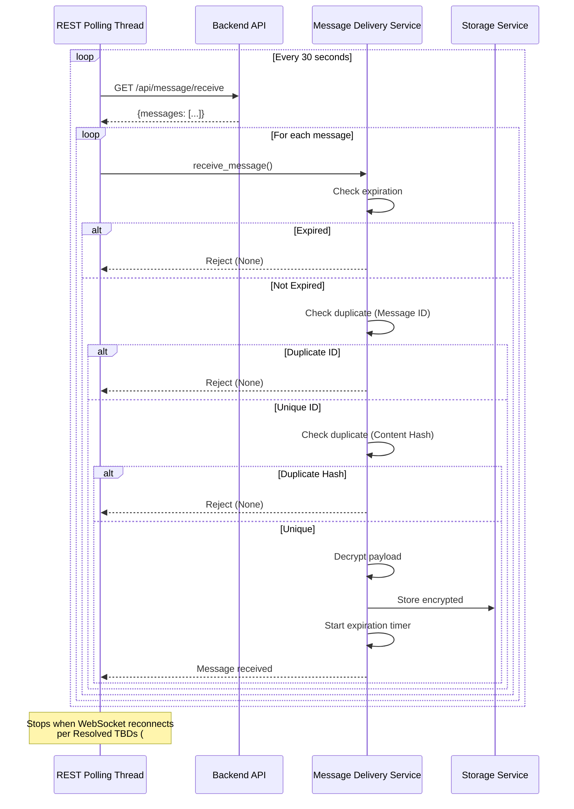
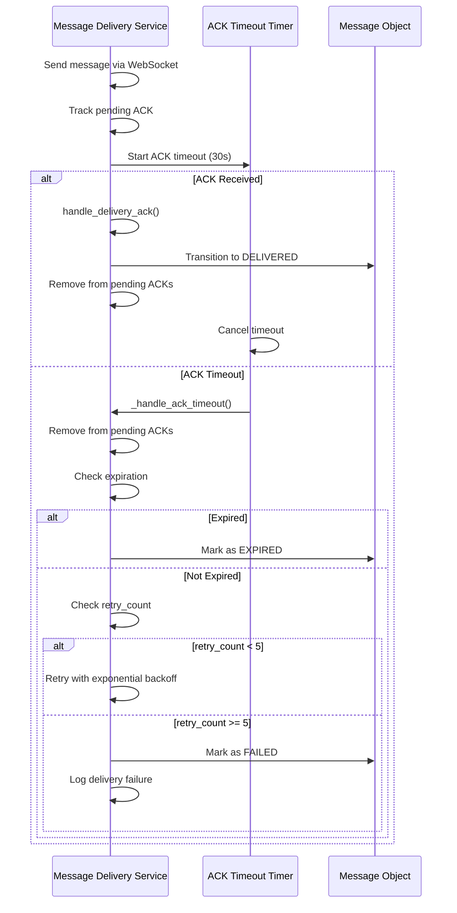

# Message Delivery Reliability & Hardening Diagrams

**References:**
- Functional Specification (#6), Sections 4.2-4.5
- State Machines (#7), Section 3
- Lifecycle Playbooks (#15), Section 5
- Resolved Specs & Clarifications (#51)
- API Contracts (#10)

## Message Delivery Lifecycle with ACK

## Retry & Failure State Transitions

## WebSocket Reconnect & REST Fallback Flow

## Exponential Backoff Retry Flow

## REST Polling Message Processing

## ACK Timeout Handling

## Key Deterministic Rules

1. **ACK Handling**: Per Resolved Clarifications (#51)
   - ACK per message ID
   - 30s timeout
   - Retry on timeout with exponential backoff

2. **Retry Policy**: Per Lifecycle Playbooks (#15) and Resolved TBDs (#19)
   - Max 5 attempts
   - Exponential backoff: base * 2^retry_count (capped at 60s)
   - Mark as FAILED after max retries

3. **Expiration Rules**: Per Functional Spec (#6), Section 4.4
   - Do not deliver expired messages
   - Remove expired messages from queue immediately
   - Expired messages cannot be recovered

4. **WebSocket Lifecycle**: Per Resolved Clarifications (#51)
   - Reconnect with exponential backoff
   - Fallback to REST polling if disconnected >15s
   - Stop REST polling when WebSocket reconnects

5. **REST Polling**: Per Resolved TBDs (#18)
   - Poll every 30 seconds
   - Respect expiration and duplicate detection
   - Only active when WebSocket unavailable

6. **Duplicate Detection**: Per Resolved Clarifications (#35)
   - Primary: Message ID comparison
   - Secondary: Content hash comparison
   - Silently discard duplicates
