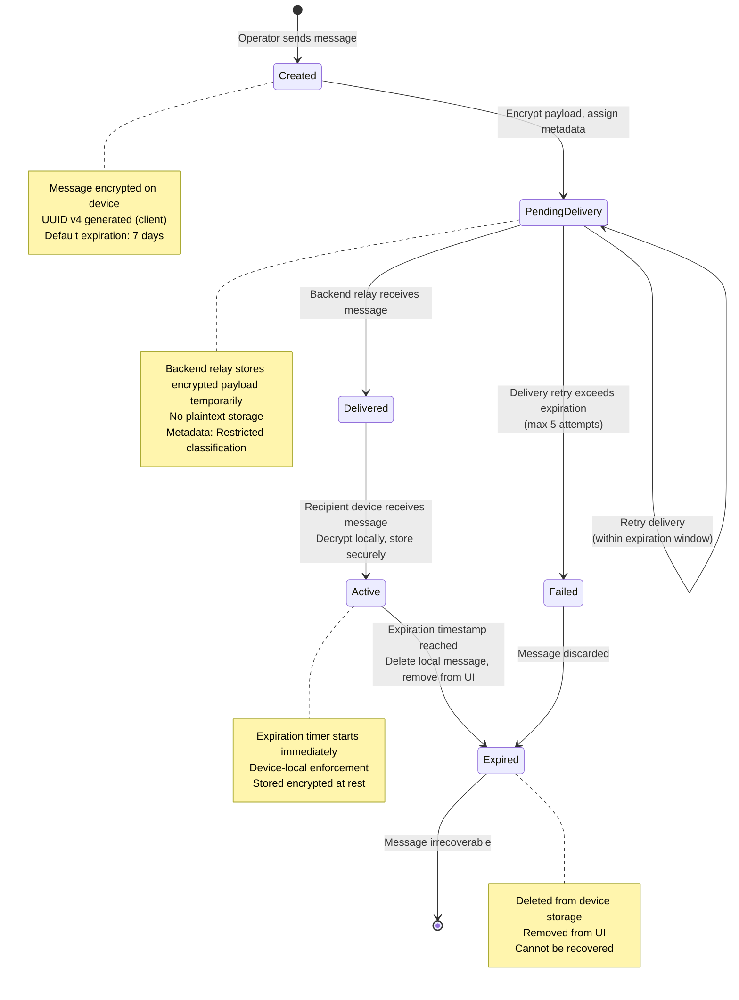
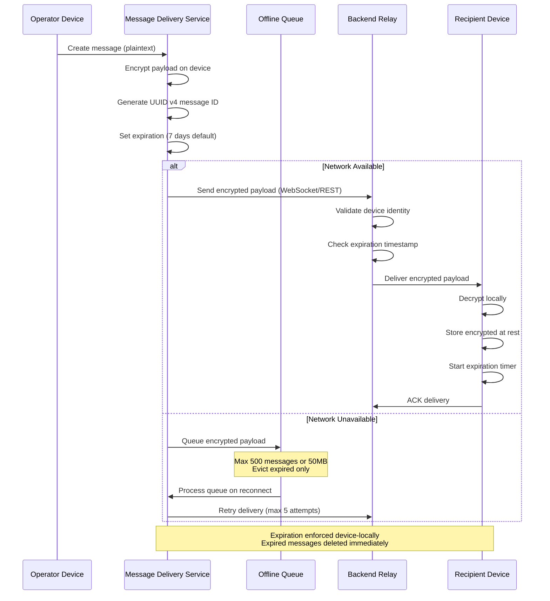
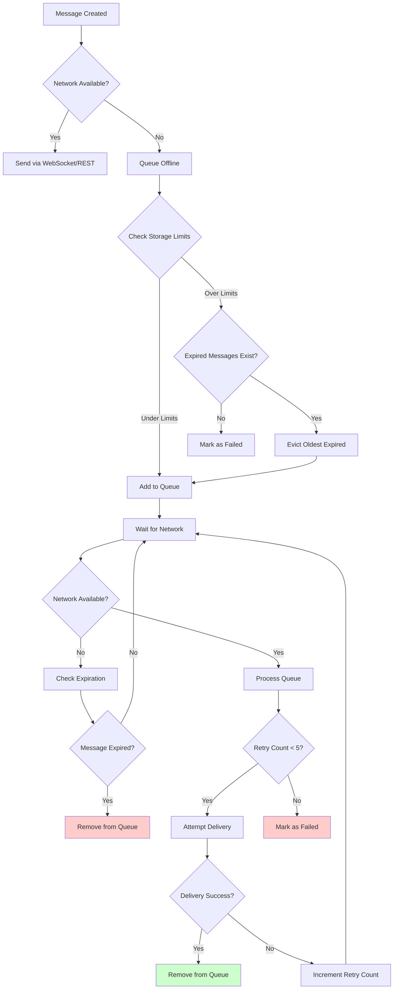
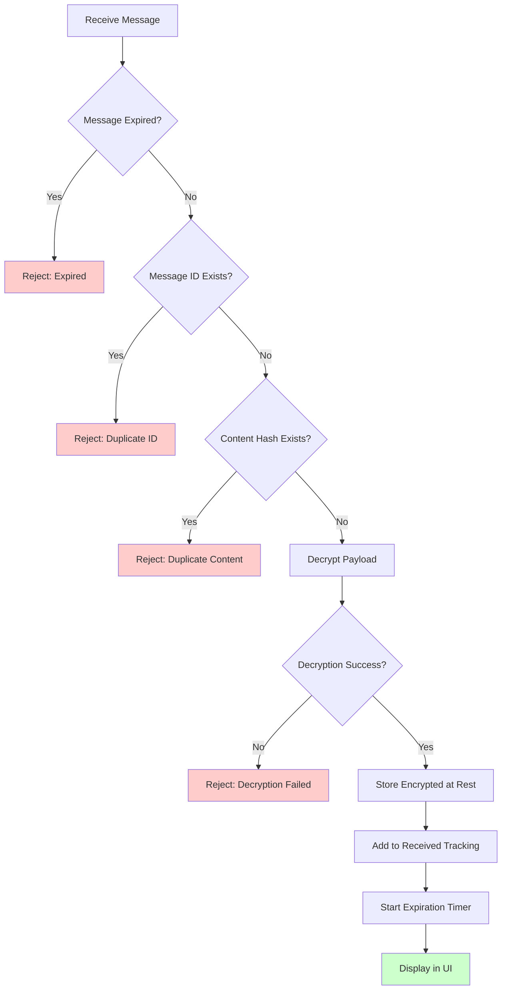

# Message Lifecycle State Diagram

**References:**
- State Machines (#7), Section 3
- Functional Specification (#6), Sections 4.2-4.5
- Lifecycle Playbooks (#15), Section 5
- Resolved Specs & Clarifications

## Message Lifecycle State Machine

## Message Delivery Flow

## Offline Queue Management

## Duplicate Detection Flow

## Key Deterministic Rules

1. **Message Expiration**: Default 7 days, enforced device-locally per State Machines (#7)
2. **Offline Storage**: Max 500 messages or 50MB, eviction only for expired messages per Resolved Clarifications
3. **Retry Limits**: Maximum 5 attempts before marking as Failed per Resolved TBDs
4. **Duplicate Detection**: Message ID first, content hash secondary per Resolved Clarifications
5. **Expiration Enforcement**: Immediate deletion on expiration, no grace period per Resolved Clarifications
6. **Delivery Mechanism**: WebSocket preferred, REST polling fallback every 30s per Resolved TBDs
