# Observability and Audit Enforcement Diagrams

**References:**
- Logging & Observability (#14)
- Data Classification & Retention (#8)
- Architecture (#9)
- Resolved Specs & Clarifications

## Observability Data Flow

## Log Event Lifecycle

```mermaid
sequenceDiagram
    participant Service as Backend Service
    participant LogSvc as Logging Service
    participant Validator as Content Validator
    participant Storage as Log Storage
    participant Audit as Audit Recorder
    
    Service->>LogSvc: log_event(event_type, event_data)
    LogSvc->>Validator: Validate event_data (content-free)
    
    alt Prohibited Content Detected
        Validator-->>LogSvc: ValueError (prohibited content)
        LogSvc-->>Service: Raise exception
    else Valid Content
        Validator-->>LogSvc: Validation passed
        LogSvc->>LogSvc: Create LogEvent (timestamp, classification)
        LogSvc->>Storage: Store log event
        LogSvc->>Audit: Record audit event (if applicable)
        LogSvc->>LogSvc: Log to Python logger
        LogSvc-->>Service: Success
    end
    
    Note over Validator: Prohibited: message_content, keys,<br/>plaintext, large strings (>1000 chars)<br/>per Logging & Observability #14, Section 4
```

## Metrics Aggregation Flow

## Audit Event Lifecycle

## Log Retention and Purge Flow

## Alert Threshold Flow

## Content Validation Flow

## Key Deterministic Rules

1. **Content-Free Logging**: No message plaintext, keys, or sensitive data per Logging & Observability (#14), Section 4
2. **Structured JSON**: All logs are structured JSON format with event_type, timestamp, event_data per Logging & Observability (#14), Section 2
3. **Retention**: Operational logs retained for 90 days per Resolved TBDs
4. **Metrics Aggregation**: Metrics aggregated in 1-hour windows per Resolved TBDs
5. **Alert Threshold**: Alert triggered if ≥5 failed deliveries in 1-hour window per Resolved TBDs
6. **Audit Events**: Append-only and immutable per Data Classification (#8), Section 3
7. **Permitted Events**: Only defined event types may be logged per Logging & Observability (#14), Section 3
8. **Deterministic**: Logs only what is defined; every log event has a clear trigger per Logging & Observability (#14), Section 2
