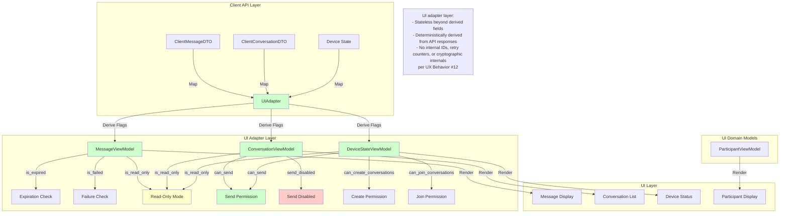
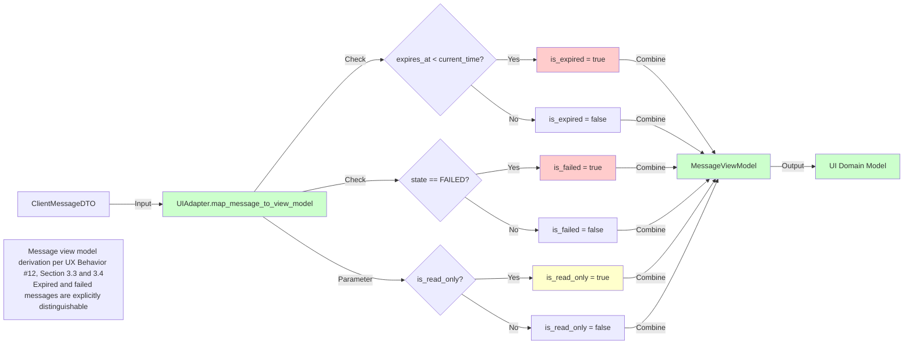
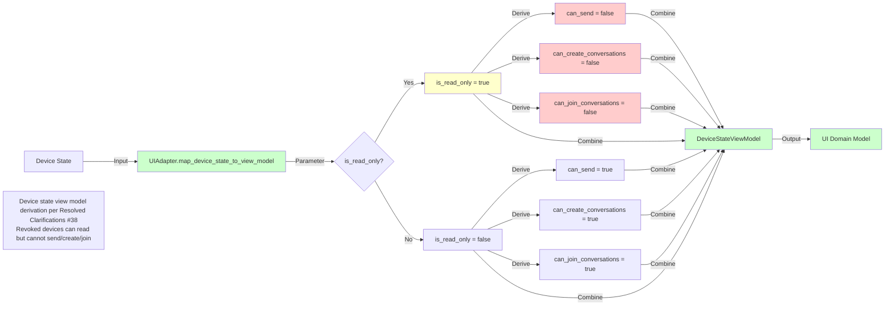
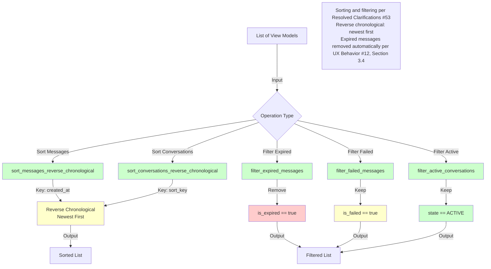
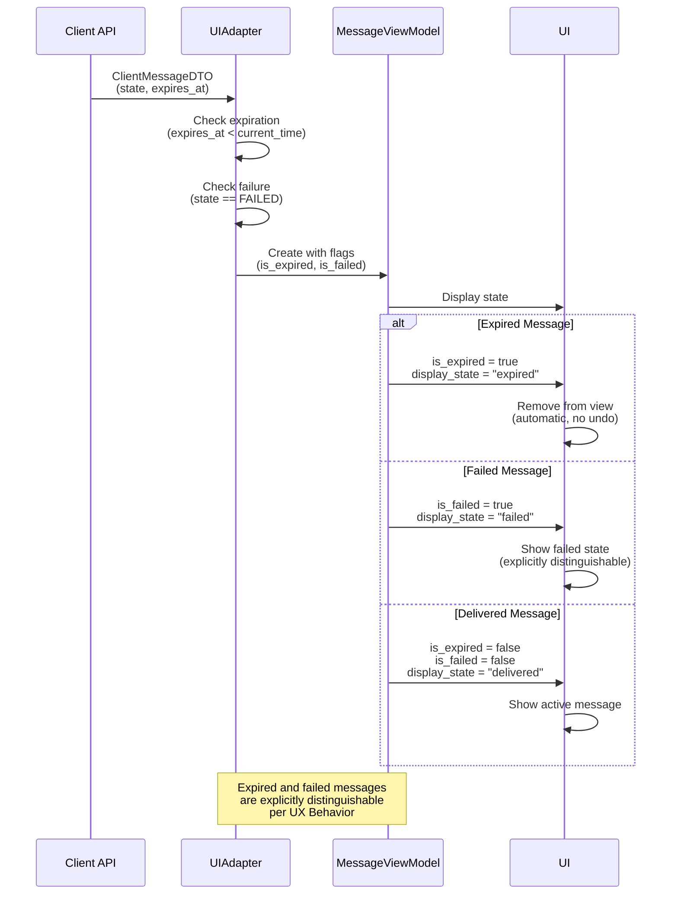

# UI Domain Adapter Layer Diagrams

**References:**
- UX Behavior (#12)
- Copy Rules (#13)
- Functional Specification (#6)
- Client-Facing API Boundary (latest)
- Resolved Specs & Clarifications

## API → UI Domain Mapping Flow



## Message View Model Derivation



## Conversation View Model Derivation

```mermaid
flowchart LR
    A[ClientConversationDTO] -->|Input| B[UIAdapter.map_conversation_to_view_model]
    
    B -->|Check| C{is_read_only?}
    C -->|Yes| D[is_read_only = true]
    C -->|No| E[is_read_only = false]
    
    B -->|Check| F{state == ACTIVE?}
    F -->|Yes| G[Active State]
    F -->|No| H[Closed State]
    
    D -->|Combine| I{Derive can_send}
    E -->|Combine| I
    G -->|Combine| I
    H -->|Combine| I
    
    I -->|Logic| J[can_send = !is_read_only && ACTIVE]
    I -->|Logic| K[send_disabled = is_read_only || CLOSED]
    
    J -->|Combine| L[ConversationViewModel]
    K -->|Combine| L
    D -->|Combine| L
    E -->|Combine| L
    
    L -->|Output| M[UI Domain Model]
    
    style B fill:#ccffcc
    style L fill:#ccffcc
    style M fill:#ccffcc
    style D fill:#ffffcc
    style K fill:#ffcccc
    
    note1[Conversation view model derivation per Resolved Clarifications #38<br/>Neutral enterprise mode: readOnly = true, sendDisabled = true]
```

## Device State View Model Derivation



## Sorting and Filtering Flow



## Neutral Enterprise Mode Flow

```mermaid
flowchart TD
    A[Device Revoked] -->|Trigger| B[is_read_only = true]
    
    B -->|Map| C[MessageViewModel]
    B -->|Map| D[ConversationViewModel]
    B -->|Map| E[DeviceStateViewModel]
    
    C -->|Set| F[is_read_only = true]
    
    D -->|Set| G[is_read_only = true]
    D -->|Set| H[can_send = false]
    D -->|Set| I[send_disabled = true]
    
    E -->|Set| J[is_read_only = true]
    E -->|Set| K[can_send = false]
    E -->|Set| L[can_create_conversations = false]
    E -->|Set| M[can_join_conversations = false]
    E -->|Set| N[display_status = "Messaging Disabled"]
    
    F -->|UI| O[Read-Only Message Display]
    G -->|UI| P[Read-Only Conversation View]
    H -->|UI| P
    I -->|UI| P
    J -->|UI| Q[Device Status Display]
    K -->|UI| Q
    L -->|UI| Q
    M -->|UI| Q
    N -->|UI| Q
    
    style B fill:#ffffcc
    style F fill:#ffffcc
    style G fill:#ffffcc
    style I fill:#ffcccc
    style J fill:#ffffcc
    style K fill:#ffcccc
    style L fill:#ffcccc
    style M fill:#ffcccc
    style N fill:#ffffcc
    
    note1[Neutral enterprise mode per Resolved Clarifications #38<br/>Revoked devices can read historical conversations<br/>but cannot send/create/join<br/>Display: "Messaging Disabled" per Copy Rules #13, Section 4]
```

## Expiration and Failure Visibility Flow



## Key Deterministic Rules

1. **Stateless View Models**: UI domain models are stateless beyond derived fields per deterministic rules
2. **Deterministic Derivation**: All UX flags are deterministically derived from API responses
3. **Neutral Enterprise Mode**: Maps to `readOnly = true`, `sendDisabled = true` per Resolved Clarifications (#38)
4. **Expiration Visibility**: Expired messages are explicitly distinguishable and removed automatically per UX Behavior (#12), Section 3.4
5. **Failure Visibility**: Failed messages are explicitly distinguishable per UX Behavior (#12), Section 3.6
6. **Reverse Chronological Ordering**: Newest first per Resolved Clarifications (#53)
7. **No Internal Leakage**: No UI domain model exposes internal IDs, retry counters, or cryptographic internals
8. **Display States**: All display states are deterministic and neutral per Copy Rules (#13), Section 3
