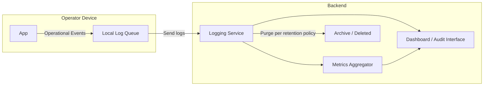

Asset #14 — Logging & Observability
Project: Abiqua Asset Management (AAM)
Document Version: 1.0
Status: Frozen
1. Purpose

This document defines all logging, monitoring, and observability behaviors for Abiqua:

What events are logged

Where logs are stored

Retention and purge policies

Monitoring signals (alerts, metrics)

All observability must respect:

Functional Spec (#6)

State Machines (#7)

Data Classification & Retention (#8)

Copy Rules (#13)

No sensitive data (message content, keys, or identity secrets) may appear in logs or monitoring systems.

2. Logging Principles

Content-free: No plaintext messages or cryptographic material.

Deterministic: Logs only what is defined; every log event has a clear trigger.

Traceable: Each log entry maps to a state machine or system action.

Time-stamped: All log entries include UTC timestamp.

Retention-bound: Logs are purged according to Data Retention rules.

3. Permitted Log Events
Event	Trigger	Details Logged	Classification
device_provisioned	Controller provisions device	device_id, timestamp, controller_id	Internal
device_revoked	Controller revokes device	device_id, timestamp, controller_id	Internal
message_attempted	Operator sends message	message_id, sender_id, recipient_count, timestamp	Internal / Restricted (metadata only)
policy_enforced	Expiration or state enforcement	device_id, policy_type, timestamp	Internal
system_start	App / backend start	timestamp	Internal
system_stop	App / backend stop	timestamp	Internal
delivery_failed	Message not delivered	message_id, timestamp	Internal / Restricted
4. Prohibited Log Content

Message plaintext

Message encryption keys

User-generated content

Identity private keys

Any sensitive metadata beyond what’s explicitly listed

5. Monitoring & Metrics
Metric	Source	Description
Active devices	Backend relay	Count of devices with Active state
Messages queued	Backend	Number of messages pending delivery
Failed deliveries	Backend	Count of messages expired without delivery
Revoked devices	Backend	Count of devices in Revoked state

Metrics must not include sensitive content

Metrics are aggregated; no per-message content is exposed

6. Alerts

Alerts are triggered only for system failures, e.g., backend down, provisioning failures

Alerts contain neutral, deterministic messages

Example: “Device provisioning failed for 1 device — see internal logs”

No sensitive content is ever included in alerts

7. Retention & Purging

All logs and metrics are retained per Data Classification & Retention (#8)

Internal logs: purge automatically after retention window (TBD, e.g., 30 days)

Metrics: retain aggregated values only; purge raw operational data beyond retention window

8. Diagram: Observability Architecture (Mermaid)

Notes:

Logs flow from device to backend securely

Logging service never stores message content

Dashboard / audit interfaces show only approved internal events and metrics

9. TBD Values

Log retention window (default 30–90 days)

Metrics aggregation interval (e.g., 1 min, 5 min)

Alert thresholds (e.g., failed delivery count triggering alert)

10. Summary Statement

Abiqua logging and observability are deterministic, neutral, and content-free.
Logs, metrics, and alerts provide operational insight without exposing sensitive messages or keys.
Cursor or developers must not add new log events or metrics beyond this specification.

End of Logging & Observability Specification