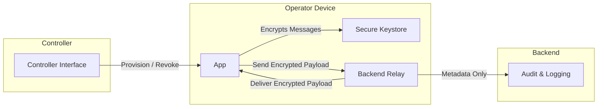

Asset #9 — System Architecture
Project: Abiqua Asset Management (AAM)
Document Version: 1.0
Status: Frozen
1. Purpose

This document defines the high-level system architecture for Abiqua.

It maps all components, their interactions, and data flows, fully constrained by:

Functional Specification (Asset #6)

State Machines (Asset #7)

Data Classification & Retention (Asset #8)

All AI implementations must follow this architecture without inventing new components or connections.

2. Components

Operator Device

Hosts app

Holds device-bound identity and cryptographic keys

Stores messages encrypted at rest

Backend Relay

Routes encrypted messages

Handles metadata for delivery and expiration

Does not store plaintext

Controller Interface

Provisions, revokes, and decommissions devices

Admin-only access

Secure Storage / Keystore

On-device storage for keys

Enforces cryptographic security

Audit & Logging Service

Records operational events (provisioning, revocation, delivery attempts)

Does not include message content

3. High-Level Interaction Diagram (Mermaid)

Notes:

Devices communicate only via encrypted messages

Backend relay does not store plaintext

Controller manages device lifecycle; operators cannot self-provision

4. Data Flow Description

Operator sends message → Encrypted payload stored locally → Transmitted to Backend → Delivered to recipient device

Recipient device decrypts → Message stored locally → Expiration timer begins

Expiration reached → Message deleted locally → No record remains

Backend retains metadata only temporarily → Logs operational events → Purged per retention policy

5. Security & Compliance Points

All confidential data is device-local and encrypted

Backend acts as relay + metadata processor only

Controller interface only allowed to provision / revoke devices

Operational logs are content-free

All flows adhere to Data Classification & Retention spec (#8)

6. TBD Values

Backend hosting platform (cloud/on-premises)

Exact transport protocol (e.g., HTTPS, WebSocket over TLS)

Scalability limits (# concurrent devices per relay)

7. Summary Statement

This diagram and component map fully constrain Abiqua’s system architecture.
No AI agent may add components, communication channels, or hidden behaviors.
All flows and connections must respect encryption, state machines, and data retention rules.